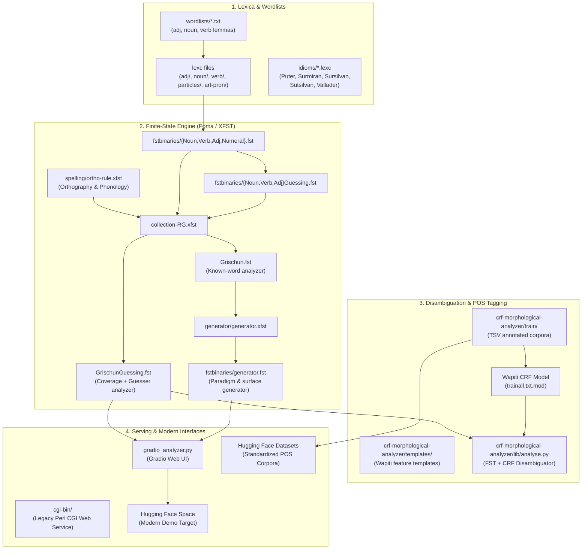

# AGENTS.md — Rumantsch Grischun Morphology Repository Guide

Welcome to the **Rumantsch Grischun Morphology** repository. This document is written for AI agents, developers, and researchers collaborating on maintaining, modernizing, and deploying the finite-state morphological processing pipeline, datasets, and web applications for Romansh (specifically *Rumantsch Grischun* and traditional regional idioms).

---

## 1. Project Overview & Context

- **Language**: Rumantsch Grischun (ISO 639-2/3: `roh` / `rm`), the standardized written variety of the Romansh language (Rhaeto-Romance branch of the Romance family, Switzerland), alongside modules for traditional written idioms (Sursilvan, Sutsilvan, Surmiran, Puter, Vallader).
- **Origin & Affiliation**: Developed at the **Department of Computational Linguistics (CL), University of Zurich (UZH)** by Simon Clematide, Reto Baumgartner, Martina Bachmann, Rolf Badat, Daniel Hegglin, Susanna Tron, Melanie Widmer, Nora Lötscher, Noëmi Aepli, Martin Cantieni, and Victoria Mosca.
- **Data & Lexicon Source**: Primary lexical data originated from and aligns with the official online dictionary **[Pledari Grond](https://pledarigrond.ch)** of the **Lia Rumantscha**, supplemented by descriptive grammars (*Grammatica d’instrucziun dal rumantsch grischun*, Caduff et al., 2009; *Rumantsch Grischun per Rumantschs*, Lia Rumantscha, 2006).
- **License**: Creative Commons Attribution-ShareAlike 4.0 International (**CC BY-SA 4.0**).
- **Core Technology**:
  - Two-level / finite-state morphology implemented in **XFST / Foma** (`.lexc` lexicons and `.xfst` rule compositions).
  - Sequence tagging and morphological disambiguation via Conditional Random Fields (**Wapiti** CRF engine).
  - Python interface and bindings (`foma`, `pyfoma`, `hfst`).
  - Web demonstrations (historically Perl CGI; currently modernizing to **Gradio** on **Hugging Face Spaces**).

---

## 2. System Architecture & Components

The repository spans four functional layers:



### 2.1 Lexical & Morphological Modules

1. **Adjectives (`adj/`, `wordlists/adj-*.txt`)**:
   - `adj/adj.xfst`, `adj-irr.lexc`, `adj-comp-irr.lexc`.
   - Regular inflection (`-`, `-a`, `-s`, `-as`), adjectives ending in `-e`, participle adjectives, invariables (`adj-inv.txt`), and irregular comparatives (`bun` -> `meglier`).
2. **Nouns (`noun/`, `wordlists/noun-*.txt`)**:
   - `noun/noun.xfst`, `noun-irr.lexc`.
   - Gender inflections (masculine, feminine), plural formation patterns (`-s`, stem alternations), singularia tantum, pluralia tantum, proper names (`noun-proper.txt`).
3. **Verbs (`verb/`, `wordlists/verb-*.txt`)**:
   - `verb/verb.xfst`, `verb-irr.lexc`, `verb-vchg.lexc` (vowel change/alternation), inflectional class lexicons (`verb-ar-end.lexc`, `verb-er-end.lexc`, `verb-ir-end.lexc`, and `-esch-` inchoative infixes).
   - Verb guesser (`VerbGuessing.fst`) guessing conjugations for unseen stems based on infinitive endings.
4. **Closed Classes & Function Words (`art-pron/`, `particles/`)**:
   - Articles (`art.lexc`): Definite (`il`, `la`, `ils`, `las`, `l'`), indefinite (`in`, `ina`).
   - Pronouns (`pron.lexc`): Personal, possessive, demonstrative, relative, interrogative, reflexive, clitic/atonic forms.
   - Conjunctions (`conj.lexc`), prepositions (`prep.lexc`), interjections (`interj.lexc`), punctuation (`interpunct.lexc`), letters (`letter.lexc`), numerals (`num/num.xfst`).
5. **Orthographic Alternation Rules (`spelling/ortho-rule.xfst`)**:
   - Handles phonological/orthographic adjustments: grave/acute accent marks, elision with apostrophe (e.g. `l'`, `d'`), capitalization of initial words (`Capitalization.fst`).
6. **Morphological Generator (`generator/generator.xfst`)**:
   - Inverts the transducer and normalizes tags using flag diacritics to map `Lemma + Features` back to inflected surface forms (e.g. `chantar + Verb + PresInd + 1P + Sg` -> `chant`).

---

## 3. The Morphosyntactic Tagset

The system follows the design recommendations of Beesley & Karttunen (2003) and Xerox Italian morphological analyzers. Tags are prefixed with `+`.

### 3.1 Major Parts of Speech (POS)
| Tag | Category (Romansh / German / English) | Example Surface | Example Analysis |
|---|---|---|---|
| `+Noun` | Substantiv / Noun | *vulp* | `vulp+Noun+Fem+Sg` |
| `+Verb` | Verb / Verb | *chantan* | `chantar+Verb+PresInd+3P+Pl` |
| `+Adj` | Adjektiv / Adjective | *grischuna* | `grischun+Adj+Fem+Sg` |
| `+Adv` | Adverb / Adverb | *puspè* | `puspè+Adv` |
| `+Art` | Artikel / Determiner/Article | *ina* | `in+Art+Indef+Fem+Sg` |
| `+Pron` | Pronomen / Pronoun | *quai* | `quai+Pron+Dem` |
| `+Prep` | Präposition / Preposition | *da* | `da+Prep` |
| `+Conj` | Konjunktion / Conjunction | *e*, *ed* | `e+Conj` |
| `+Subj` | Subjunktion / Subordinating Conj. | *perquai che* | `perquai che+Subj` |
| `+Prop` | Eigenname / Proper Noun | *Breil* | `Breil+Prop` |
| `+Num` | Zahlwort / Number word | *dus* | `dus+Num+Card+Masc` |
| `+Dig` | Ziffer / Digit string | *1982* | `1982+Dig+Card` |
| `+Prt` | Partikel / Particle (Negation) | *betg*, *na* | `betg+Prt+Neg` |
| `+Interj` | Interjektion / Interjection | *oia* | `oia+Interj` |
| `+Abbr` | Abkürzung / Abbreviation | *dr.* | `dr.+Abbr` |
| `+Punc` | Satzzeichen / Punctuation | `.` | `.+Sent`, `(+Punc+Beg` |

### 3.2 Grammatical Sub-features
- **Gender**: `+Masc` (masculine), `+Fem` (feminine), `+MF` (invariant/either).
- **Number**: `+Sg` (singular), `+Pl` (plural).
- **Person**: `+1P`, `+2P`, `+3P`.
- **Verb Tense / Mood**: `+Inf` (infinitive), `+PresInd` (present indicative), `+ImpInd` (imperfect indicative), `+PastPart` (past participle), `+Gerund` (gerund), `+Cond` (conditional), `+Con` (conjunctive/subjunctive), `+Impv` (imperative).
- **Pronoun Types**: `+Dem`, `+Indef`, `+Interrog`, `+Pers`, `+Poss`, `+Refl`, `+Rel`.
- **Special Markers**:
  - `*` prefix: Capitalized surface form (e.g. `*il+Art+Def+Fem+Sg` for `La`).
  - `+Apo`: Form with elision / apostrophe (e.g. `l'`, `d'`).
  - `+UNKNOWN`: Output by the guessing transducers (`GrischunGuessing.fst`) when the stem was predicted rather than found in the curated lexicon.
  - `+Typo`, `+Lingo`: Annotation markers for typos or non-standard dialectal forms in corpus files.

---

## 4. Annotated Datasets & Corpus Structure

In `crf-morphological-analyzer/train/`, the repository preserves manually annotated and verified Romansh corpora in Tab-Separated Values (`.tsv`) format:

```
<Token> \t <Lemma> \t <MorphologicalTag(s)> [\t <ProblemComment>]
```

| Dataset | File / Location | Tokens | Sents | Description |
|---|---|---|---|---|
| **La Quotidiana** | `train/rmquotidiana/*.tsv`, `train/quotidiana-done.tsv` | ~4,625 | ~190 | Real-world news text from the Romansh daily newspaper *La Quotidiana* (1997–2008). 11 articles. Fully lemmatized & tagged. |
| **Dardin** | `train/dardin.tsv` | ~492 | 31 | Local history and encyclopedic article on Dardin (Breil/Brigels). Fully lemmatized and tagged. |
| **Wiki Dino** | `train/wiki-dino.tsv` | ~504 | 21 | Wikipedia article on dinosaurs. Scientific/taxonomic prose. Morphologically tagged (`???` placeholder for lemmas). |
| **RTR News** | `train/rtr.tsv` | ~732 | 44 | Radio e Televisiun Svizra Rumantscha political news report (Peter Peyer election). Fully lemmatized & tagged. |
| **Train Misc** | `train/train-misc.tsv` | ~3,995 | 176 | Diverse cultural/biographical Wikipedia texts (e.g. Gian Bundi). Morphologically tagged (`???` for lemmas). |
| **Total Benchmark** | Combined | **~10,400** | **~460** | Complete set of morphosyntactically annotated sentences. |

---

## 5. Disambiguation with Conditional Random Fields (CRF)

Because morphological transducers generate all possible analyses for a surface word (e.g. *era* can be a noun *era* "garden bed", adverb *era* "also", or verb *esser* imperfect 1P/3P "was"), sequence disambiguation is needed.

- **Engine**: **Wapiti** CRF tool (`wapiti train`, `wapiti label`).
- **Feature Template**: `crf-morphological-analyzer/templates/rumantsch-template.txt` extracts:
  - Unigram word patterns, lowercase forms, capitalization indicators (`^\u`).
  - Prefix lengths (1–3 chars), suffix lengths (1–3 chars).
  - Suffix bigrams across consecutive tokens.
- **Combined Inference (`crf-morphological-analyzer/lib/analyse.py`)**:
  1. Runs `flookup` on `GrischunGuessing.fst` to get candidate analyses.
  2. Runs `wapiti label -m modell9 -n 3` to get the top 3 POS predictions and scores.
  3. Computes the intersection between the CRF tag sequence and FST tagsets to rank and select the optimal reading.

---

## 6. Directory Map

```
rumantsch-morphologie/
├── AGENTS.md                  # This file (system guide for agents)
├── HF_DATASET.md              # Implementation plan for Hugging Face datasets
├── HF_DEMO_SPACE.md           # Implementation plan for Hugging Face Gradio Space
├── Makefile                   # Top-level build rules for Foma/XFST
├── Makefile-foma              # Build rules specialized for Foma
├── Makefile-idioms            # Build rules for traditional dialectal idioms
├── collection-RG.xfst         # Master XFST composition script (Grischun.fst & GrischunGuessing.fst)
├── Grischun.fst               # Compiled FST binary (known lexicon)
├── GrischunGuessing.fst       # Compiled FST binary (lexicon + guessing priority union)
├── gradio_analyzer.py         # Gradio demo implementation
├── Pipfile / Pipfile.lock     # Python dependency specifications
├── adj/                       # Adjective FST scripts and lexc files
├── adv/                       # Adverb FST scripts
├── art-pron/                  # Article and pronoun lexc files
├── cgi-bin/                   # Legacy web demo CGI scripts
│   ├── rumantschcrfmorphanalysis.cgi
│   ├── rumantschgenerator.cgi
│   └── tools/analyse.py
├── crf-morphological-analyzer/ # CRF training, evaluation, and datasets
│   ├── Makefile               # Makefile for training Wapiti models and CV evaluation
│   ├── templates/             # Wapiti feature extraction templates
│   ├── train/                 # Gold annotated corpora (dardin, quotidiana, dino, rtr, misc)
│   └── lib/                   # Disambiguation and evaluation helper scripts
├── docs/                      # Extensive linguistic documentation (documentation.md)
├── fstbinaries/               # Component FSTs (Noun, Verb, Adj, Numeral, generator.fst)
├── generator/                 # Morphological generator rules (generator.xfst)
├── idioms/                    # Overrides and rules for traditional idioms (Sursilvan, Puter, etc.)
├── lib/                       # Utility scripts (testing, format conversions, analysis)
├── noun/                      # Noun FST scripts and lexc files
├── num/                       # Numeral FST scripts
├── particles/                 # Conjunctions, prepositions, interjections, punctuation lexc files
├── spelling/                  # Orthographic and capitalization rewrite rules
├── test/                      # Regression and coverage test data
├── wordlists/                 # Raw lemma wordlists extracted from Pledari Grond
└── www/                       # Static web documentation assets
```

---

## 7. Developer & Agent Operational Recipes

### 7.1 Compiling the Transducers
To rebuild the FST binaries from `.lexc`, `.xfst`, and `wordlists/`:
```bash
# Using Foma (recommended):
make -f Makefile-foma

# Or using standard make (invoking foma or xfst):
make build

# To clean compiled binaries:
make clean
```

### 7.2 Running FST Analysis in Python
> [!IMPORTANT]
> **Use the `foma` C-binding package rather than `pyfoma`!**
> `pyfoma 2.0.0` has compatibility limitations when reading complex `.fst` binaries compiled by Foma CLI, causing `analyze()` and `generate()` to return empty lists. The native `foma` package (`import foma; f = foma.FST.load('GrischunGuessing.fst')`) loads the transducer instantly and operates with high throughput:

```python
import foma

# Load transducer
f = foma.FST.load("GrischunGuessing.fst")

# Analyze a surface word (apply_up)
analyses = f.apply_up("vulp")
print(analyses)  # ['vulp+Noun+Fem+Sg']

# Capitalized surface form
analyses_la = f.apply_up("La")
print(analyses_la)  # ['*il+Art+Def+Fem+Sg', '*ella+Pron+Pers+AccDat+Aton+3P+Fem+Sg']

# Generate surface form from lemma + tags (apply_down)
forms = f.apply_down("vulp+Noun+Fem+Pl")
print(forms)  # ['vulps']
```

### 7.3 Testing with `flookup`
If testing from the command line:
```bash
echo "La vulp era puspè ina giada fomentada." | tr ' ' '\n' | flookup GrischunGuessing.fst
```

### 7.4 Running the Gradio Web Demo Locally
```bash
.venv/bin/python gradio_analyzer.py
```
*(See `HF_DEMO_SPACE.md` for refactoring `gradio_analyzer.py` to use `foma.FST.load()` and modern Gradio components).*

### 7.5 Training & Evaluating Wapiti Tagger from Hugging Face Data
To download the standardized dataset splits directly from Hugging Face Hub, train the Wapiti CRF model, and evaluate both raw and FST-constrained accuracy:
```bash
# End-to-end download, training, and evaluation
make hf-all

# Or individual targets:
make hf-data   # Download and format splits to crf-morphological-analyzer/hf_data/
make hf-train  # Train CRF with early stopping on validation split
make hf-eval   # Evaluate against test split (outputs accuracy & confusion pairs)
make hf-clean  # Clean downloaded data and trained model artifacts
```

---

## 8. Strategic Roadmap for Agents

When implementing future tasks, consult these dedicated plans:
1. **Hugging Face Datasets**: Refer to [`HF_DATASET.md`](file:///Users/siclemat/pj/2018/rumantsch-morphologie/HF_DATASET.md) for the conversion pipeline, schema definitions, UPOS mapping, and publishing instructions.
2. **Hugging Face Space Demo**: Refer to [`HF_DEMO_SPACE.md`](file:///Users/siclemat/pj/2018/rumantsch-morphologie/HF_DEMO_SPACE.md) for the Gradio architecture, container dependencies (`packages.txt`), UI tabs (Analysis, Generation, Paradigm), and deployment steps.
