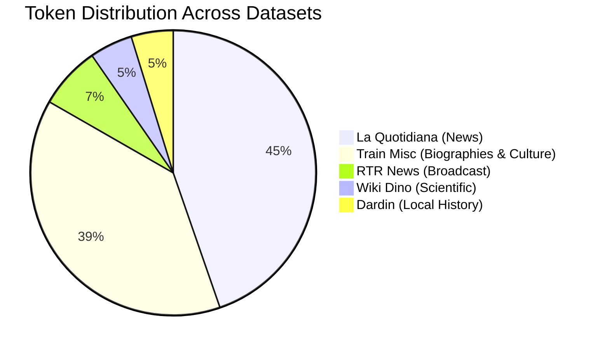
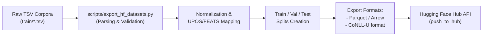

# Implementation Plan: Publishing Rumantsch Grischun POS-Tagging Datasets to Hugging Face (`HF_DATASET.md`)

This document outlines the end-to-end plan to extract, standardize, document, and publish the Romansh (*Rumantsch Grischun*) POS-tagging and morphological datasets currently housed in `crf-morphological-analyzer/train/` to the **Hugging Face Hub**.

---

## 1. Executive Summary & Objectives

- **The Need**: Romansh (`rm` / `roh`) is a national language of Switzerland and a low-resource Romance language. As of today, there are virtually no open, high-quality, token-level morphosyntactic datasets for Rumantsch Grischun on the Hugging Face Hub.
- **The Asset**: The repository contains **~10,400 gold-annotated tokens (~460 sentences)** spanning five distinct genres/sources (news journalism, local history, scientific encyclopedia, political broadcasting, and cultural biography).
- **The Goals**:
  1. Publish the **native Xerox/Foma morphological annotations as the primary representation** to support reproducing and training the FST + sequence tagger pipeline.
  2. Preserve missing lemmas (`???`) strictly as unpredicted `None` / `null` in the gold reference layer rather than silently imputing them.
  3. Derive standardized **Universal Dependencies (UD)** UPOS and FEATS as an explicit secondary layer.
  4. Preserve original document boundaries and **10-fold cross-validation partitions** from the CRF evaluation harness.
  5. Publish with comprehensive dataset cards detailing provenance and linguistic characteristics under **CC BY-SA 4.0**.

---

## 2. Dataset Inventory & Linguistic Characteristics

All gold data files reside in `crf-morphological-analyzer/train/`. Each dataset covers different stylistic registers:



### 2.1 Detailed Corpus Profiles

| Dataset Identifier | Raw Source Files | Approx. Tokens | Approx. Sents | Genre & Register | Lemmatized? | Description & Value |
|---|---|---|---|---|---|---|
| **`quotidiana`** | `rmquotidiana/*.tsv` (11 articles), `quotidiana-done.tsv` | 4,625 | 190 | News journalism | **Yes** (Gold lemmas) | Articles from the Romansh daily newspaper *La Quotidiana* (1997–2008). High syntactical variety, standard contemporary Rumantsch Grischun. |
| **`dardin`** | `dardin.tsv`, `dardin-tagged-with-lemma.txt` | 492 | 31 | Local history & geography | **Yes** (Gold lemmas) | Encyclopedic text regarding Dardin (Breil/Brigels) in Surselva. Clean, standard prose. |
| **`wiki_dino`** | `wiki-dino.tsv` | 504 | 21 | Popular science | Partially (`???` placeholder) | Romansh Wikipedia article on dinosaurs. Rich in Latinate scientific terms, complex compound punctuation, and descriptive relative clauses. |
| **`rtr`** | `rtr.tsv` | 732 | 44 | Broadcast political news | **Yes** (Gold lemmas + notes) | RTR news report regarding cantonal government elections (Peter Peyer, SP). High density of named entities, abbreviations, and quotes. |
| **`misc`** | `train-misc.tsv` | 3,995 | 176 | Biographies & encyclopedic articles | Partially (`???` placeholder) | Cultural texts, including the life of Romansh fairy tale collector Gian Bundi. Diverse vocabulary. |
| **`all` (Benchmark)** | Concatenation of all 5 | **10,348** | **462** | Cross-genre benchmark | Mixed | Master training/evaluation set for token classification and tagging. |

---

## 3. Data Format, Cleaning & Normalization

### 3.1 Raw Data Format
The input files are formatted as tab-separated values (TSV), with blank lines indicating sentence boundaries:
```tsv
La	*il	+Art+Def+Fem+Sg
partida	partida	+Noun+Fem+Sg
socialdemocratica	socialdemocratic	+Adj+Fem+Sg
(	(	+Punc+Beg
PS	PS	+Abbr	#PROBLEM: +Prop?
)	)	+Punc+End
ha	avair	+Verb+PresInd+3P+Sg
lantschà	lantschar	+Verb+PastPart+Masc+Sg
.	.	+Sent
```

### 3.2 Cleaning Rules & Edge Cases
When parsing into Hugging Face datasets:
1. **Comment / Problem Stripping**:
   - Lines with 4th columns such as `#PROBLEM: Fehler, wäre vuless` or `#PROBLEM: +Prop?` must have comments separated into a dedicated `annotation_notes` metadata field or stripped from the gold tag.
2. **Capitalization Prefixes**:
   - Lemmas with leading asterisks (e.g. `*il`, `*fatg`, `*pia`) indicate capitalization in the surface form. Store the normalized dictionary lemma (`il`, `fatg`, `pia`) in `lemma` and keep the capitalization flag in `is_capitalized`.
3. **Placeholder Lemmas**:
   - In `wiki-dino.tsv` and `train-misc.tsv`, unresolved lemmas are marked as `???`. These should be converted to `None` / `null` in JSON/Arrow or optionally imputed using the FST analyzer (`Grischun.fst`).
4. **Special Quality Tags**:
   - `+Typo` and `+Lingo` tags (e.g. `+Adj+Fem+Pl+Typo`): Extract base morphological tags and set boolean flags `is_typo=True` or `is_lingo=True`.
5. **Apostrophes and Contractions**:
   - Tokens such as `l'`, `d'`, `ch'` have tag `+Apo`. Ensure token boundaries match whitespace tokenization standards while preserving `Apo=Yes`.

---

## 4. Tagset Standardization & Universal Dependencies Mapping

To make the datasets maximally usable by modern neural models (BERT, RoBERTa, XML-RoBERTa, ByT5), the dataset will provide both native **Foma/Xerox tags** and standardized **Universal Dependencies (UD) UPOS** tags.

### 4.1 UPOS Mapping Table

| Native Foma Primary Tag | Description | UD UPOS Equivalent | Example |
|---|---|---|---|
| `+Noun` | Common Noun | `NOUN` | *vulp* (fox), *chaschiel* (cheese) |
| `+Prop` | Proper Noun / Name | `PROPN` | *Breil*, *Berna*, *Peter* |
| `+Verb` | Verb (lexical & auxiliary) | `VERB` / `AUX` | *chantar* (sing), *esser* (be) |
| `+Adj` | Adjective | `ADJ` | *grischun*, *bel*, *situada* |
| `+Adv` | Adverb | `ADV` | *puspè*, *oz*, *uschia* |
| `+Art` | Determiner / Article | `DET` | *il*, *la*, *in*, *ina* |
| `+Pron` | Pronoun | `PRON` | *jau*, *quai*, *che*, *se* |
| `+Prep` | Preposition / Adposition | `ADP` | *da*, *en*, *per*, *cun* |
| `+Conj` | Coordinating Conjunction | `CCONJ` | *e*, *ed*, *u*, *ma* |
| `+Subj` | Subordinating Conjunction | `SCONJ` | *perquai*, *sche*, *cura* |
| `+Num` | Numeral word | `NUM` | *dus*, *treis*, *milli* |
| `+Dig` | Digit number | `NUM` | *1872*, *26*, *800* |
| `+Prt` (`+Prt+Neg`) | Particle (Negation) | `PART` | *betg*, *na*, *n'* |
| `+Interj` | Interjection | `INTJ` | *oia*, *he* |
| `+Abbr`, `+Initial` | Abbreviation | `NOUN` / `PROPN` / `ADV` | *dr.*, *s.l.n.* |
| `+Punc`, `+Sent`, `+CM` | Punctuation | `PUNCT` | `.`, `,`, `(`, `)`, `:`, `?` |
| `+Let`, `+Rom`, `+Symbol` | Letters, Roman numerals, symbols | `SYM` / `X` | `†`, `*`, `IV` |

### 4.2 Morphological Feature Decomposition (UD FEATS)
Native tags will also be unpacked into a structured feature dictionary:
- `+PresInd` -> `Tense=Pres|Mood=Ind`
- `+ImpInd` -> `Tense=Imp|Mood=Ind`
- `+PastPart` -> `Tense=Past|VerbForm=Part`
- `+Inf` -> `VerbForm=Inf`
- `+Fem`, `+Masc` -> `Gender=Fem`, `Gender=Masc`
- `+Sg`, `+Pl` -> `Number=Sing`, `Number=Plur`
- `+1P`, `+2P`, `+3P` -> `Person=1`, `Person=2`, `Person=3`
- `+Def`, `+Indef` -> `PronType=Art|Definite=Def`, `PronType=Art|Definite=Ind`

---

## 5. Hugging Face Dataset Schema

Each example in the dataset represents a complete sentence:

```python
from datasets import Features, Sequence, Value, ClassLabel

POS_CLASSES = [
    "ADJ", "ADP", "ADV", "AUX", "CCONJ", "DET", "INTJ", "NOUN",
    "NUM", "PART", "PRON", "PROPN", "PUNCT", "SCONJ", "SYM", "VERB", "X"
]

features = Features({
    "id": Value("string"),
    "corpus": Value("string"),          # 'quotidiana', 'dardin', 'wiki_dino', etc.
    "tokens": Sequence(Value("string")),
    "lemmas": Sequence(Value("string")), # None if unavailable
    "upos": Sequence(ClassLabel(names=POS_CLASSES)),
    "native_pos": Sequence(Value("string")), # e.g. "+Noun", "+Verb"
    "morph_tags": Sequence(Value("string")), # e.g. "+Verb+PresInd+3P+Sg"
    "feats": Sequence(Value("string")),      # e.g. "Gender=Fem|Number=Sing"
})
```

---

## 6. Repository Strategy on Hugging Face

We recommend publishing **two complementary presentations**:

### Presentation A: Unified Multi-Config Repository (Recommended Standard)
- **Repository ID**: `CL-UZH/rumantsch-grischun-pos` (or user/org namespace)
- **Configurations (`subsets`)**:
  - `default` or `all`: Combined benchmark across all sources (~10.4k tokens).
  - `quotidiana`: *La Quotidiana* newspaper articles (~4.6k tokens).
  - `dardin`: Dardin village history text (~500 tokens).
  - `wiki_dino`: Wikipedia dinosaur article (~500 tokens).
  - `rtr`: RTR political broadcast news (~750 tokens).
  - `misc`: Wikipedia cultural/biographical articles (~4.0k tokens).
- **Usage**:
  ```python
  from datasets import load_dataset
  
  # Load specific genre:
  dataset_news = load_dataset("CL-UZH/rumantsch-grischun-pos", "quotidiana")
  
  # Load full benchmark:
  dataset_all = load_dataset("CL-UZH/rumantsch-grischun-pos", "all")
  ```

### Presentation B: Standalone Repositories
For researchers looking exclusively for specific genres, publish mirrored standalone repositories:
- `CL-UZH/rumantsch-quotidiana-pos`
- `CL-UZH/rumantsch-dardin-pos`
- `CL-UZH/rumantsch-wiki-dino-pos`
- `CL-UZH/rumantsch-rtr-pos`

---

## 7. Splitting Strategy (Train / Validation / Test)

For reproducibility and benchmark consistency:

1. **For `quotidiana` (Document-based split)**:
   - Split by entire newspaper articles to prevent cross-sentence leakage.
   - Train: 8 articles (~3,300 tokens)
   - Validation: 1 article (~600 tokens)
   - Test: 2 articles (~700 tokens)
2. **For `all` (Aggregated Benchmark)**:
   - Train (80%): ~8,200 tokens
   - Validation (10%): ~1,000 tokens
   - Test (10%): ~1,100 tokens (including held-out articles and `wiki-dino`)
3. **Cross-Validation Metadata**:
   - For historical comparison with `learn-pos.d/`, include a `cv_fold: 1..10` field indicating the 10-fold split defined in the original Makefile.

---

## 8. Automated Conversion & Publishing Script

A dedicated Python script `scripts/export_hf_datasets.py` will be created in this repository:



### Key Script Capabilities:
- Parses TSV files handling multi-column variations (2 cols, 3 cols, 4 cols with `#PROBLEM:` notes).
- Validates token counts and UTF-8 encoding integrity.
- Translates native tagsets to UPOS.
- Generates train/validation/test splits.
- Automatically generates Hugging Face Dataset Card metadata (`README.md`).
- Pushes directly to the Hugging Face Hub using `huggingface_hub.HfApi` and `datasets.DatasetDict.push_to_hub`.

---

## 9. Hugging Face Dataset Card Specification (`README.md`)

The published dataset repository will include the following standard YAML metadata:

```yaml
---
language:
- rm
license: cc-by-sa-4.0
size_categories:
- 1K<n<10K
task_categories:
- token-classification
task_ids:
- part-of-speech
- lemmatization
pretty_name: Rumantsch Grischun Part-of-Speech & Morphological Tagging
tags:
- low-resource
- romance
- romansh
- linguistics
- morphology
configs:
- config_name: all
  data_files:
  - split: train
    path: data/all/train-*
  - split: validation
    path: data/all/val-*
  - split: test
    path: data/all/test-*
- config_name: quotidiana
  data_files:
  - split: train
    path: data/quotidiana/train-*
  - split: validation
    path: data/quotidiana/val-*
  - split: test
    path: data/quotidiana/test-*
---
```

### Dataset Card Content Sections:
1. **Summary**: Description of Romansh, Rumantsch Grischun, and the dataset provenance.
2. **Supported Tasks**: Part-of-Speech tagging (UPOS), fine-grained morphological tagging, lemmatization.
3. **Languages**: Romansh (`rm`), specifically Rumantsch Grischun standard.
4. **Data Fields**: Explanations of `id`, `tokens`, `lemmas`, `upos`, `native_pos`, `morph_tags`, `feats`.
5. **Data Splits**: Statistics table for train/dev/test splits for each config.
6. **Annotation Process**: Historical details from UZH ICL, student annotators, cross-checking against Pledari Grond.
7. **Citation**: Formal citation for the dataset and software tools.

---

## 10. Step-by-Step Execution Plan

| Step | Action Item | Artifact / Tool | Deliverable |
|---|---|---|---|
| **Phase 1** | Implement dataset parser & UPOS mapper | `scripts/export_hf_datasets.py` | Standalone Python module reading all 5 source corpora |
| **Phase 2** | Clean annotations & handle edge cases | Unit tests / validation scripts | Cleaned JSONL / Parquet files with zero parse errors |
| **Phase 3** | Produce splits & export to Parquet | `datasets` library | Structured dataset bundles (`all`, `quotidiana`, `dardin`, `wiki_dino`, `rtr`, `misc`) |
| **Phase 4** | Draft Dataset Card | `dataset_card/README.md` | Complete documentation with YAML tags and citation |
| **Phase 5** | Authentication & Hub Upload | `huggingface-cli login`, `push_to_hub` | Live datasets on Hugging Face Hub |
| **Phase 6** | Verification | `load_dataset(...)` test | Validated seamless loading in Colab / Python scripts |
