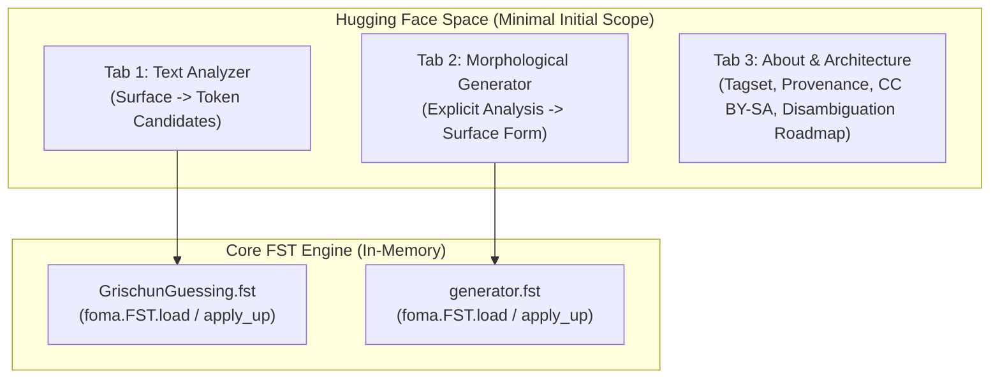

# Implementation Plan: Hugging Face Space Web Demo (`HF_DEMO_SPACE.md`)

This document presents the detailed architectural and engineering plan for deploying the **Rumantsch Grischun Morphological Processing System** as an interactive, public web demonstration on **Hugging Face Spaces**.

---

## 1. Vision & Target User Experience

The goal is to provide a fast, focused, and linguistically accurate web interface on **Hugging Face Spaces** representing the first stage of the Rumantsch Grischun morphological pipeline.



### Core Components (Release 1)
1. **Text Analyzer**:
   - Tokenizes Romansh text (handling elisions like *l'*, *d'*, *ch'*).
   - Generates and displays all morphological candidates supplied by `GrischunGuessing.fst`.
   - Results are explicitly presented as **morphological candidate analyses**, not contextually resolved readings.
   - Highlights known lexicon entries vs. guessed stems (`+UNKNOWN`).
2. **Morphological Generator**:
   - Accepts an explicitly specified morphological analysis string (e.g. `chantar+Verb+PresInd+1P+Sg`).
   - Maps directly to inflected surface form(s) using `fstbinaries/generator.fst` (`apply_up`).
3. **About & Linguistic Documentation**:
   - Detailed explanation of the Xerox/Foma tagset.
   - Provenance (*Lia Rumantscha / Pledari Grond* and *UZH ICL*).
   - CC BY-SA 4.0 license attribution.
   - Clarification of the architectural division between FST candidate generation and contextual sequence disambiguation.

---

## 2. Technical Stack & Hugging Face Runtime

### 2.1 Space Configuration
- **Platform**: Hugging Face Spaces.
- **SDK**: **Gradio** (`gradio>=5.0.0`).
- **Hardware Tier**: CPU Basic (Free) is more than sufficient:
  - FST files are ~1.4 MB each.
  - In-memory RAM usage is < 150 MB.
  - Query latency is sub-millisecond per token.
- **Container Environment**: Debian Linux (Hugging Face default).

### 2.2 Transducer Runtime: Why `foma` C-Bindings
In earlier experiments (`gradio_analyzer.py`), `pyfoma 2.0.0` was attempted, but its pure-Python deserializer failed on complex Foma binary networks. In contrast, the native **`foma` Python module** (via `pip install foma`) connects directly to `libfoma.so` via `ctypes`:
- **Loads binary `.fst` files instantly**: `f = foma.FST.load('GrischunGuessing.fst')`.
- **Bidirectional execution**:
  - `f.apply_up(surface_word)`: Upward morphological analysis.
  - `f.apply_down(lemma_and_tags)`: Downward surface form generation.
- **System dependency**: Installed in the Debian container using `packages.txt`.

### 2.3 Required Space Configuration Files

#### `packages.txt` (System Packages)
```
libfoma0
libfoma-dev
foma-bin
```

#### `requirements.txt` (Python Packages)
```
gradio>=5.4.0
foma>=1.0.0
pandas>=2.0.0
```

#### `README.md` (Hugging Face Space Metadata)
```yaml
---
title: Rumantsch Grischun Morphological Analyzer
emoji: 🏔️
colorFrom: blue
colorTo: red
sdk: gradio
sdk_version: 5.4.0
app_file: app.py
pinned: false
license: cc-by-sa-4.0
short_description: Morphological analysis & paradigm generation for Romansh
---
```

---

## 3. Application Architecture & UI Design

The new application (`app.py`) will replace the prototype `gradio_analyzer.py`:

### 3.1 Tokenization Module
Romansh has frequent contraction and elision with apostrophes (e.g. *l'aura*, *d'in*, *ch'el*, *n'ha*). The tokenizer splits words while preserving apostrophe attachments:
```python
import re

TOKEN_REGEX = re.compile(
    r"""
    (?:[A-Za-zÀ-ÿ]+'[A-Za-zÀ-ÿ]+)|    # Contractions like ch'el, l'aura
    (?:[A-Za-zÀ-ÿ]+'|'[A-Za-zÀ-ÿ]+)|  # Trailing/leading apostrophes
    (?:[A-Za-zÀ-ÿ]+)|                 # Standard words
    (?:\d+(?:[.,]\d+)?)|              # Numbers
    (?:[.,!?;:„"'"'()«»–—-])          # Punctuation
    """,
    re.VERBOSE
)
```

### 3.2 Human-Readable Tag Translation
Raw tags like `+Verb+PresInd+3P+Sg` are translated into clean UI badges:
```python
TAG_TRANSLATIONS = {
    "Verb": ("Verb", "primary"),
    "Noun": ("Noun", "success"),
    "Adj": ("Adjective", "info"),
    "Adv": ("Adverb", "warning"),
    "Art": ("Article", "neutral"),
    "Pron": ("Pronoun", "neutral"),
    "Prep": ("Preposition", "neutral"),
    "Conj": ("Conjunction", "neutral"),
    "PresInd": ("Present Indicative", None),
    "PastPart": ("Past Participle", None),
    "ImpInd": ("Imperfect Indicative", None),
    "Cond": ("Conditional", None),
    "1P": ("1st Person", None),
    "2P": ("2nd Person", None),
    "3P": ("3rd Person", None),
    "Sg": ("Singular", None),
    "Pl": ("Plural", None),
    "Fem": ("Feminine", None),
    "Masc": ("Masculine", None),
    "UNKNOWN": ("Guessed Form", "accent"),
}
```

### 3.3 Multi-Tab User Interface Layout

```
+-------------------------------------------------------------------------+
|                      🏔️ Rumantsch Morphological Studio                   |
|       Finite-State Morphological Analysis & Generation for Romansh      |
+-------------------------------------------------------------------------+
| [🔍 Text Analyzer] | [⚙️ Paradigm Generator] | [🗣️ Dialects] | [📖 About]  |
+-------------------------------------------------------------------------+
|                                                                         |
| Input Text (Romansh):                                                   |
| [ La vulp era puspè ina giada fomentada.                              ] |
|                                                                         |
| [ 🚀 Analyze Text ]                                                     |
|                                                                         |
| ── Analyzed Tokens ───────────────────────────────────────────────────  |
| | Token      | Lemma      | POS   | Features               | Status   | |
| |------------|------------|-------|------------------------|----------| |
| | La         | il         | Art   | Def, Fem, Sg           | Curated  | |
| | vulp       | vulp       | Noun  | Fem, Sg                | Curated  | |
| | era        | esser      | Verb  | ImpInd, 1P/3P, Sg      | Curated  | |
| | puspè      | puspè      | Adv   | -                      | Curated  | |
| | ina        | in         | Art   | Indef, Fem, Sg         | Curated  | |
| | giada      | giada      | Noun  | Fem, Sg                | Curated  | |
| | fomentada  | fomentar   | Verb  | PastPart, Fem, Sg      | Curated  | |
|                                                                         |
| ── Detailed Raw Readings (Click token for alternatives) ─────────────── |
| ...                                                                     |
+-------------------------------------------------------------------------+
```

---

## 4. Source Code Blueprint for `app.py`

Here is the operational blueprint for the Hugging Face Space application:

```python
import os
import re
import gradio as gr
import pandas as pd

# Load native Foma library
try:
    import foma
    FOMA_LOADED = True
except ImportError:
    FOMA_LOADED = False

class RomanshMorphEngine:
    def __init__(self, guessing_fst="GrischunGuessing.fst", generator_fst="generator.fst"):
        self.analyzer = None
        self.generator = None
        if FOMA_LOADED and os.path.exists(guessing_fst):
            self.analyzer = foma.FST.load(guessing_fst)
        if FOMA_LOADED and os.path.exists(generator_fst):
            self.generator = foma.FST.load(generator_fst)

    def analyze_word(self, token):
        if not self.analyzer:
            return [("N/A", "FST not loaded", "error")]
        
        raw_analyses = list(self.analyzer.apply_up(token))
        
        # Fallback to lowercase if titlecased and not found
        if not raw_analyses and token != token.lower():
            raw_analyses = list(self.analyzer.apply_up(token.lower()))
            
        if not raw_analyses:
            return [(token, "+?", "unknown")]
            
        results = []
        for a in raw_analyses:
            is_guessed = "+UNKNOWN" in a
            clean = a.replace("+UNKNOWN", "")
            # Split lemma and tags
            parts = clean.split("+", 1)
            lemma = parts[0].lstrip("*")
            tags = "+" + parts[1] if len(parts) > 1 else ""
            results.append((lemma, tags, "guessed" if is_guessed else "curated"))
        return results

    def analyze_sentence(self, text):
        tokens = re.findall(r"\w+(?:'\w+)?|[.,!?;:„\"'«»]", text)
        rows = []
        for t in tokens:
            analyses = self.analyze_word(t)
            for i, (lemma, tags, status) in enumerate(analyses):
                rows.append({
                    "Token": t if i == 0 else "",
                    "Lemma": lemma,
                    "Reading #": i + 1,
                    "Morphological Analysis": tags,
                    "Lexicon Status": status
                })
        return pd.DataFrame(rows)

    def generate_forms(self, lemma, pos, feature_filter=""):
        if not self.generator:
            return "Generator FST not available."
        query = f"{lemma}+{pos}{feature_filter}"
        forms = list(self.generator.apply_up(query))
        if not forms:
            # Try downward mapping
            forms = list(self.generator.apply_down(query))
        return "\n".join(forms) if forms else "No generated forms found."

engine = RomanshMorphEngine()

# Build Gradio UI
with gr.Blocks(title="Rumantsch Morphological Analyzer", theme=gr.themes.Soft()) as demo:
    gr.Markdown("# 🏔️ Rumantsch Morphological Studio")
    gr.Markdown("**Finite-State Morphological Analysis and Generation for Rumantsch Grischun**")
    
    with gr.Tab("🔍 Text & Sentence Analyzer"):
        with gr.Row():
            input_box = gr.Textbox(
                label="Input Romansh Text",
                placeholder="Enter text...",
                value="La vulp era puspè ina giada fomentada.",
                lines=3
            )
        btn_analyze = gr.Button("Analyze", variant="primary")
        output_df = gr.Dataframe(label="Morphological Analyses", interactive=False)
        btn_analyze.click(engine.analyze_sentence, inputs=input_box, outputs=output_df)
        
        gr.Examples([
            ["La vulp era puspè ina giada fomentada."],
            ["Qua ha ella vis in corv che tegneva in toc chaschiel."],
            ["Ils uffants giugavan en il prau verdegiont."],
            ["Nus essan or da chasa per ir a scola."]
        ], inputs=input_box)

    with gr.Tab("⚙️ Paradigm & Form Generator"):
        with gr.Row():
            in_lemma = gr.Textbox(label="Lemma", value="chantar")
            in_pos = gr.Dropdown(label="POS Category", choices=["Verb", "Noun", "Adj"], value="Verb")
            in_feat = gr.Textbox(label="Optional Feature Tag", placeholder="+PresInd+1P+Sg")
        btn_gen = gr.Button("Generate Form(s)")
        out_gen = gr.Textbox(label="Generated Result", lines=6)
        btn_gen.click(engine.generate_forms, inputs=[in_lemma, in_pos, in_feat], outputs=out_gen)

    with gr.Tab("📖 Documentation & Tagset"):
        gr.Markdown("""
        ### Resources & Attribution
        - **Pledari Grond**: Official online dictionary by Lia Rumantscha ([pledarigrond.ch](https://pledarigrond.ch))
        - **License**: Creative Commons Attribution-ShareAlike 4.0 International (**CC BY-SA 4.0**)
        - **Developed at**: Institute of Computational Linguistics, University of Zurich
        """)

if __name__ == "__main__":
    demo.launch()
```

---

## 5. Deployment Workflow to Hugging Face Spaces

### Step 1: Create Hugging Face Space
Using the Hugging Face Web UI or CLI:
- Name: `rumantsch-grischun-morphology`
- SDK: `Gradio`
- License: `CC BY-SA 4.0`

### Step 2: Assemble Space Repository Files
Collect the deployment bundle:
- `app.py`
- `GrischunGuessing.fst` (1.37 MB)
- `fstbinaries/generator.fst` -> `generator.fst` (1.4 MB)
- `packages.txt`
- `requirements.txt`
- `README.md`

### Step 3: Automated Push via Git or Hugging Face API
```bash
git clone https://huggingface.co/spaces/<org-or-username>/rumantsch-grischun-morphology space_repo
cp app.py space_repo/
cp GrischunGuessing.fst space_repo/
cp fstbinaries/generator.fst space_repo/generator.fst
cp packages.txt requirements.txt space_repo/
cd space_repo
git add .
git commit -m "Deploy Rumantsch Grischun Morphological Studio"
git push origin main
```

---

## 6. Implementation Roadmap & Verification Checklist

| Milestone | Action Item | Target Criteria |
|---|---|---|
| **Phase 1** | Refactor `gradio_analyzer.py` -> `app.py` | Working local instance running on `foma.FST.load()` |
| **Phase 2** | Add Generator & Paradigm features | `generator.fst` integrated with interactive inputs |
| **Phase 3** | Package and configure dependencies | `packages.txt` and `requirements.txt` verified |
| **Phase 4** | Deploy to Hugging Face Space | Space builds green with 0 startup errors |
| **Phase 5** | Verification & User Acceptance | Full sentence analysis and verb conjugation generation verified |
